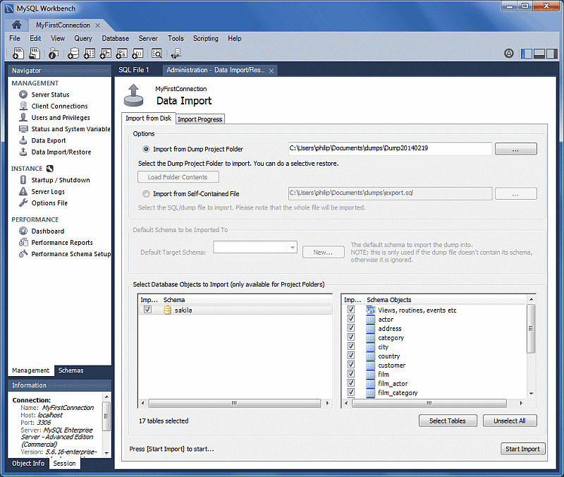

# Connect to the MySQL DB System

## Introduction

You cannot connect directly from a remote IP to the endpoint of a DB system. Use SSH or RDP to connect to a compute instance, and from the compute instance use MySQL Shell, MySQL Client or MySQL Workbench to connect to the DB system.


_Estimated Time:_ 15 minutes

### Objectives

In this lab, you will be guided through the following task:

- Connect to database using MySQL Shell
- Connect to database using MySQL Workbench

### Prerequisites

- An Oracle Trial or Paid Cloud Account
- Some Experience with MySQL Shell
- Completed Lab 2

## Task 1: Connect to database using MySQL Shell

1. If not already connected with SSH, on Command Line, connect to the Compute instance using SSH ... be sure replace the  "private key file"  and the "new compute instance ip"

     ```bash
    <copy>ssh -i private_key_file opc@new_compute_instance_ip</copy>
     ```

2. Use the following command to connect to MySQL using the MySQL Shell client tool. Be sure to add the **heatwave-db** private IP address at the end of the command. You saved this private IP in Lab2 > Task 4 > Step 2. Also enter the admin user and the db password created on Lab 1

    (Example  **mysqlsh -uadmin -p -h10.0.1..   --sql**)

    **[opc@...]$**

    ```bash
    <copy>mysqlsh -uadmin -p -h 10.0.1.... --sql</copy>
    ```

    

3. List schemas in your heatwave instance

    ```bash
    <copy>show databases;</copy>
    ```

    

## Task 2: Connect to database using MySQL Workbench

Use MySQL Workbench on a compute instance to connect to the endpoint of the DB system. Do the following to connect to the endpoint of the DB system:

1. Setup SSH key
    - download the ssh key from the OCI cloud shell.
    - Copy the downloaded file to your local C:\Users\yourname\.ssh folder         **Do not overwrite any existing id_rsa file. Give the downloaded file a new name**
    

2. Launch MySQL Workbench.
3. On the home page, click the + sign besides **MySQL Connections**.
4. In the **Setup New Connection** dialog box, provide the following details:
    - **Connection Name**: Specify a name of the connection.
    - **Connection Method**: Select Standard TCP/IP over SSH.
5. In the Parameters tab, provide the following details:
    - **SSH Hostname**: Specify the public IP address of the compute instance.
    - **SSH Username**: Specify opc.
    - **SSH Key File**: Specify the path to your SSH private key.
    - **MySQL Hostname**: Specify the IP address of the endpoint of your DB system.
    - **MySQL Server Port**: Specify the port the MySQL endpoint is listening on.
    - **Username**: Specify the username you defined when creating the DB system.
    - **Password**: Specify the password you defined when creating the DB system.
    
6. Click **Test Connection** to confirm that the connection details are valid.
7. Click **Close**.
8. Click new connection name to start Workbench

## Task 3: Import Dtabase using MySQL Workbench

You can use the Data Import pane to import or restore exported data from the data export operation or from the mysqldump command.

1. In MySQL Workbench, on the Navigator pane, select Data Import/Restore.
2. the project folder or self-contained SQL file, select the schema to import into, or select the New button to define a new schema.
3. Select Start Import to begin the import process.

    

You may now **proceed to the next lab**

## Acknowledgements

- **Author** - Perside Foster, MySQL Solution Engineering

- **Contributors** - Nick Mader, MySQL Global Channel Enablement & Strategy Manager
- **Last Updated By/Date** - Perside Foster, MySQL Solution Engineering, October 2023