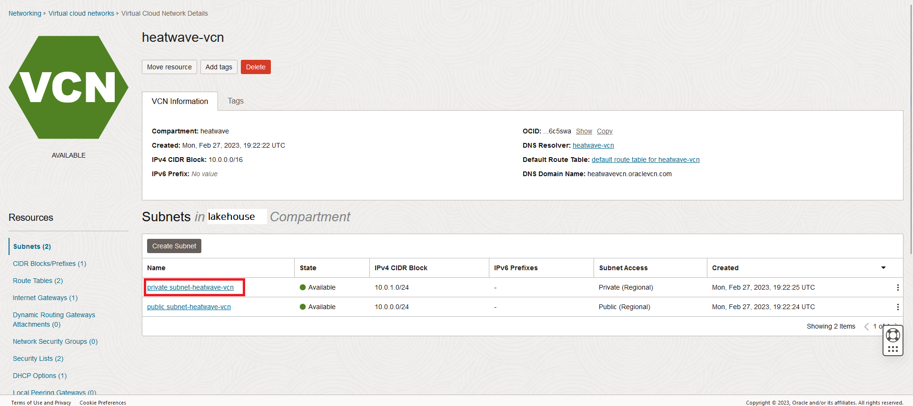

# Create Compartment, VCN, and MySQL HeatWave Database

## Introduction

In this lab, you will create a Compartment and  Virtual Cloud Network (VCN) to connect your OCI resources. You will also create a MySQL HeatWave DB System while loading the DB Data.

_Estimated Time:_ 20 minutes

### Objectives

In this lab, you will be guided through the following tasks:

- Create a Compartment
- Create a Virtual Cloud Network
- Configure a security list to allow MySQL incoming connections
- Create a MySQL Database for HeatWave DB System while loading the DB Data


### Prerequisites

- An Oracle Trial or Paid Cloud Account
- Some Experience with MySQL Shell
- Login to OCI to land on OCI Dashboard


## Task 1: Create Compartment

1. Click the **Navigation Menu** in the upper left, navigate to **Identity & Security** and select **Compartments**.

2. On the Compartments page, click **Create Compartment**.

3. In the Create Compartment dialog box, complete the following fields:

    Name:

    ```bash
    <copy>heatwave</copy>
    ```

    Description:

    ```bash
    <copy>Compartment for MySQL HeatWave Database workshop </copy>
    ```

4. The **Parent Compartment** should be **heatwave** and click **Create Compartment**
    

## Task 2: Create Virtual Cloud Network

1. Click Navigation Menu
    Select Networking
    Select Virtual Cloud Networks
    

2. Click **Start VCN Wizard**
    

3. Select 'Create VCN with Internet Connectivity'

    Click 'Start VCN Wizard'
    

4. Create a VCN with Internet Connectivity

    On Basic Information, complete the following fields:

    VCN Name:

    ```bash
    <copy>heatwave-vcn</copy>
    ```

    Compartment: Select  **heatwave**

    Your screen should look similar to the following
        

5. Click 'Next' at the bottom of the screen

6. Review Oracle Virtual Cloud Network (VCN), Subnets, and Gateways

    Click 'Create' to create the VCN

7. The Virtual Cloud Network creation is completing
    

8. Click 'View VCN' to display the created VCN
    

## Task 2: Configure security list to allow MySQL incoming connections

1. On heatwave-vcn page under 'Subnets in heatwave Compartment', click  '**private subnet-heatwave-vcn**'
     

2. On Private Subnet-heatwave-vcn page under 'Security Lists',  click  '**Security List for private subnet-heatwave-vcn**'
    

3. On Security List for Private Subnet-heatwave-vcn page under 'Ingress Rules', click '**Add Ingress Rules**'
    

4. On Add Ingress Rules page under Ingress Rule

    Add an Ingress Rule with Source CIDR

    ```bash
    <copy>0.0.0.0/0</copy>
    ```

    Destination Port Range

    ```bash
    <copy>3306,33060</copy>
    ```

    Description

    ```bash
       <copy>MySQL Port Access</copy>
    ```

5. Click 'Add Ingress Rule'
    

6. On Security List for Private Subnet-heatwave-vcn page, the new Ingress Rules will be shown under the Ingress Rules List
    

## Task 4: Create MySQL HeatWave (DB System)

1. Go to Navigation Menu
         Databases
         MySQL
         DB Systems
    

2. Click 'Create MySQL DB System'
    

3. Select the Development or Testing Option
    

4. Create MySQL DB System dialog complete the fields in each section

    - Provide basic information for the DB System
    - Setup your required DB System
    - Create Administrator credentials
    - Configure Networking
    - Configure placement
    - Configure hardware
    - Select Backup Option
    - Advanced Options - Connections
  
5. Provide basic information for the DB System:

    Select Compartment **heatwave**

    Enter Name

    ```bash
    <copy>heatwave-db</copy>
    ```

    Enter Description

    ```bash
    <copy>MySQL DB for HeatWave</copy>
   ```

    

6. Select **“Standalone”** and Turn Off  **“Configure MySQL HeatWave”**
    

7. Create Administrator Credentials

    **Enter Username** (write username to notepad for later use)
    - **Note**: user name is case sensitive so use **admin** to match the the labs' connect string example

    **Enter Password** (write password to notepad for later use)

    **Confirm Password** (value should match password for later use)

    

8. On Configure networking, keep the default values

    Virtual Cloud Network: **heatwave-vcn**

    Subnet: **Private Subnet-heatwave-vcn (Regional)**

    

9. On Configure placement under 'Availability Domain'

    Select AD-1

    Do not check 'Choose an Availability Domain' for this DB System.

    

10. On Configure hardware, keep default shape as **MySQL.VM.Standard.E4.4.64GB**

    Data Storage Size (GB) Set value to:  **1024**

    ```bash
    <copy>1024</copy>
    ```

    

11. On Configure Backups, Select 'Enable Automatic Backup'

    

12. Click on Show Advanced Options

13. Go to the Connections tab, in the Hostname field enter  (same as DB System Name):

    ```bash
    <copy>heatwave-db</copy> 
    ```

    

14. Review **Create MySQL DB System**  Screen

    Click the '**Create**' button

15. The New MySQL DB System will be ready to use after a few minutes

16. The state 'Active' indicates that the DB System is ready for use
 
17. On **heatwave-db** Page,select the **Connections** tab, check and save the Endpoint (Private IP Address). Later, you will need this value to connect to the Heatwave DB using the MySQL Shell client tool.
    
You may now **proceed to the next lab**

## Acknowledgements

- **Author** - Perside Foster, MySQL Solution Engineering

- **Contributors** - Nick Mader, MySQL Global Channel Enablement & Strategy Manager
- **Last Updated By/Date** - Perside Foster, MySQL Solution Engineering, October 2023
