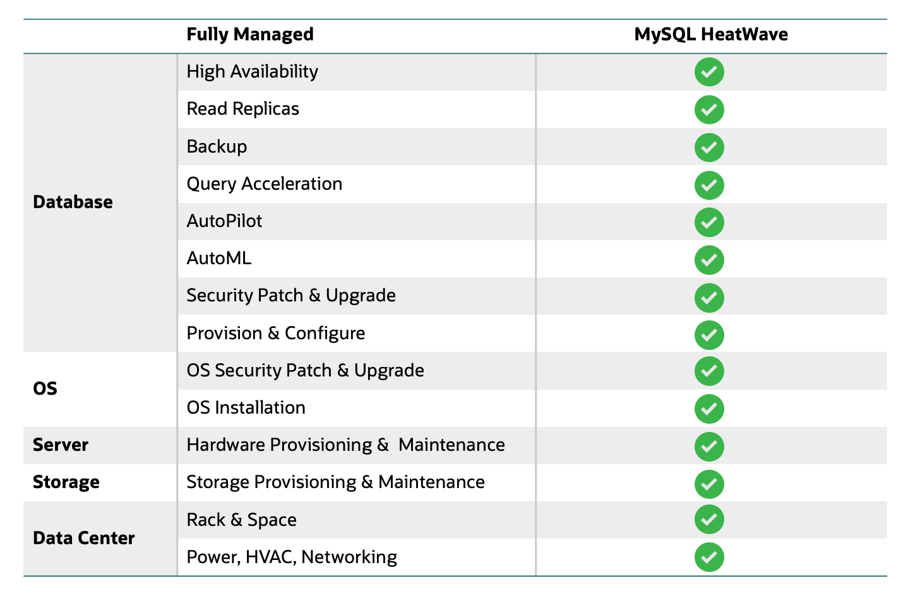

# Introduction

## About this Workshop

Oracle MySQL HeatWave is a managed database service on OCI that aims to provide a highly scalable and available database service without the need to plan and carry out tedious day-to-day operational tasks. Improve productivity by automating time-consuming tasks such as high-availability management, patching, upgrades, and backup with a fully managed database service. Free up time of developers, DBAs, and DevOps to focus on the value added tasks that are core to your business.

In this workshop, you will learn how to manually launch your MySQL HeatWave DB, an optional Compute Instance as a bastion host,use MySQL Workbench to load data into HeatWave, and Setup HeatWave high-availability.

_Estimated Time:_ 1 hours

### About Product/Technology

Oracle MySQL HeatWave is a fully managed Oracle Cloud Infrastructure (OCI) database service that lets developers quickly develop and deploy secure, cloud native applications. MySQL HeatWave is 100% built, managed, and supported by the OCI and MySQL engineering teams. One MySQL cloud database service for transactions, real-time analytics across data warehouses and data lakes, and machine learning (ML)—without the complexity, latency, risks, and cost of extract, transform, and load (ETL) duplication. Available on Oracle Cloud Infrastructure (OCI), Amazon Web Services (AWS), and Microsoft Azure.

#### MySQL HeatWave: Fully Managed Database Service

  

### Objectives

In this lab, you will be guided through the following steps:

- Create MySQL Database for HeatWave (DB System) instance
- Create SSH Key on Oracle Cloud Infrastructure Cloud Shell
- Setup Compute instance
- Connect to DB System using MySQL Shell 
- Load Data into MySQL HeatWave with Workbench
- Manage MySQL HeatWave High Availability
- Monitor MySQL HeatWave

### Prerequisites

- An Oracle Free Tier, Paid or LiveLabs Cloud Account
- Some Experience with MySQL Shell - [MySQL Site](https://dev.MySQL.com/doc/MySQL-shell/8.0/en/).

You may now **proceed to the next lab**

## Acknowledgements

- **Author** - Perside Foster, MySQL Solution Engineering

- **Contributors** - Abhinav Agarwal, Senior Principal Product Manager, Nick Mader, MySQL Global Channel Enablement & Strategy Manager
- **Last Updated By/Date** - Perside Foster, MySQL Solution Engineering, September 2023

[def]: videohub:VideoID