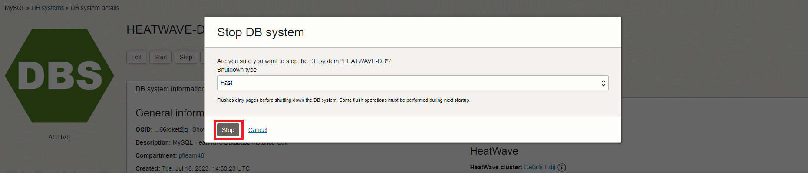
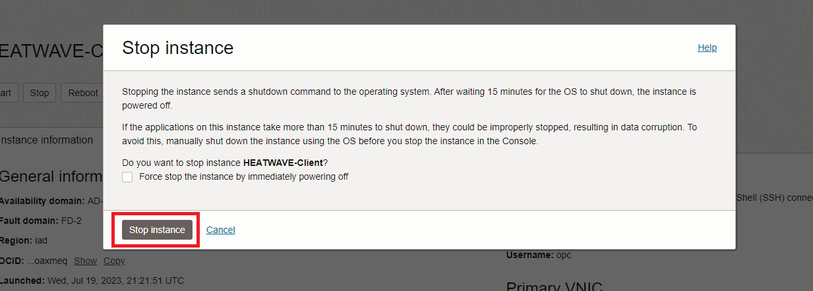

# Stop OCI Services

## Introduction

In this lab you will use the Console to View HeatWave Metrics and  Stop the Services you created in this Workshop.

_Estimated Time:_ 5 minutes

### Objectives

In this lab, you will be guided through the following task:

- View MySQLHeatWave Metrics
- Stop HeatWave Database Instance
- Stop Compute Instance

### Prerequisites

- An Oracle Trial or Paid Cloud Account
- Some Experience with MySQL Shell
- Completed Lab1 and Lab2

## Task 1: View MySQLHeatWave Metrics

Do the following to view the metrics for your DB system:

1. Open the navigation menu and click Databases. Under MySQL HeatWave, click DB systems.
2. Choose the Compartment from the List scope.
3. Click the name of the DB system to open the DB system details page.
4. Under Resources, click Metrics.
5. Use the Metrics data filter to view metrics for a particular resource:
    - All: Displays metrics for all resources.
    - DB system: Displays metrics for the current DB system.
    - Backup: Displays metrics for all backups of the current DB system.

## Task 2: Stop HEATWAVE-DB Database Instance

1. Open the navigation menu  
    - Databases
    - MySQL
    - DB Systems
2. Choose the **heatwave** Compartment. A list of DB Systems is displayed.
    

3. In the displayed Instance Click **Stop**.
    

4. In the displayed **Stop DB system** dialog box, click the  **Stop** button.
    

## Task 3: Stop HEATWAVE-Client Compute Instance

1. Open the navigation menu  
    - Compute
    - Instances

2. Choose the **heatwave** Compartment. A list of Compute intances is displayed. In the list of Compute Instances, click the **HEATWAVE-Client** instance.
    

3. In the displayed Instance Click **Stop**.
    

4. In the displayed **Stop Instance** dialog box, click the  **Stop instance** button.
    

**Congratulations!  You have successfully finished the Workshop.**

## Learn More

- [Oracle Cloud Infrastructure MySQL Database Service Documentation](https://docs.cloud.oracle.com/en-us/iaas/MySQL-database)
- [MySQL Database Documentation](https://www.MySQL.com)

## Acknowledgements

- **Author** - Perside Foster, MySQL Principal Solution Engineering
- **Contributors** - Mandy Pang, MySQL Principal Product Manager,  Nick Mader, MySQL Global Channel Enablement & Strategy Manager
- **Last Updated By/Date** - Perside Foster, MySQL Solution Engineering, July 2023