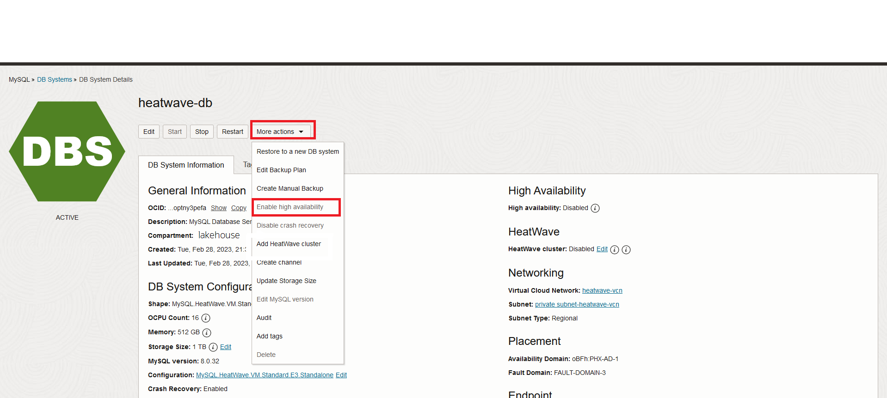
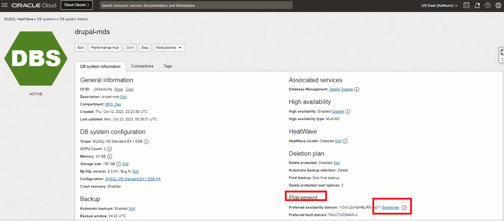

# Setup MySQL HeatWave High Availability

## Introduction

A high availability DB system is made up of three MySQL instances: a primary instance, and two secondary instances. All data that you write to the primary instance is copied to the secondary instances. A high availability DB system guarantees if one instance fails, another takes over, with zero data loss and minimal downtime.

_Estimated Time:_ 15 minutes

### Objectives

In this lab, you will be guided through the following task:

- Enable High Availability
- Perform a Switchover

### Prerequisites

- An Oracle Trial or Paid Cloud Account
- Some Experience with MySQL Shell
- Completed Lab 3

## Task 1: Enable High Availability

Enabling high availability on a standalone DB system creates a highly available DB system using the existing MySQL instance as the primary instance, creating two more secondary instances, and replicating the data present in the primary instance to the secondary instances.

To enable high availability on a DB system, do the following:

1. Go to Navigation Menu
    Databases
        MySQL

2. Click the `heatwave-db` Database System link

    

3. In the list of DB Systems, click the **heatwave-db** system. click **More Action ->  AEnable high availability**.
    

4. In the Enable high availability dialog box, click Enable.

    The DB system enters the UPDATING state. The selected configuration is applied to the DB system and the secondary instances are cloned from the primary instance. If the updating process fails, the DB system returns to a standalone state. Check the work request for information.

## Task 2: Perform a Switchove

You can manually promote one of the secondary MySQL instances as the primary instance. This is called as switchover.

When you perform a switchover, the preferred placement changes to the newly selected placement of the primary instance, that is, the current placement of the primary instance is same as the preferred placement. The IP address of the DB system endpoint does not change. Switchover results in a short period of downtime while the primary instance is redirected to the newly promoted instance.

This task requires the following:
    - A running DB system with high availability enabled.

Do the following to switch from the current primary instance to one of the secondary instances:

1. Open the navigation menu. Under MySQL HeatWave, click DB Systems.
2. Choose the compartment from the List Scope.
3. In the list of DB systems, find the DB system you want to switch, and do the following:
Click the name of the DB system to open the DB System Details page. Select Switchover from the Placement section.
    

4. In the Switchover dialog box, select the availability or fault domain, depending on your setup, which contains the instance you want to switch to.
5. Click Switchover.

The status of the DB system changes to Updating, and the selected instance becomes the primary.

You may now **proceed to the next lab**

## Acknowledgements

- **Author** - Perside Foster, MySQL Solution Engineering

- **Contributors** - Abhinav Agarwal, Senior Principal Product Manager, Nick Mader, MySQL Global Channel Enablement & Strategy Manager
- **Last Updated By/Date** - Perside Foster, MySQL Solution Engineering, May 2023
